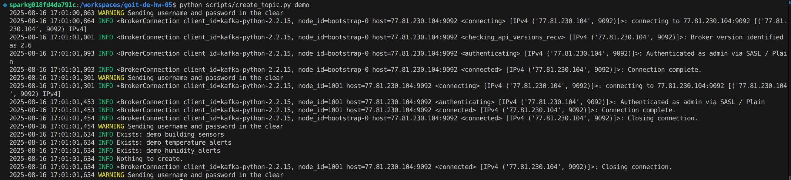
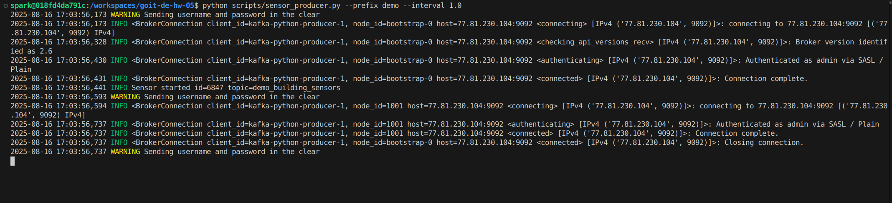
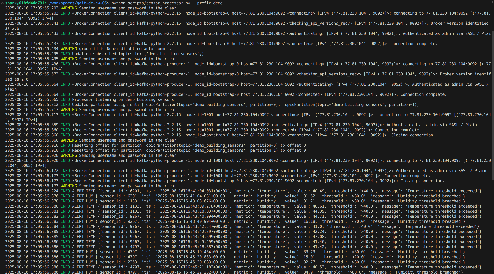
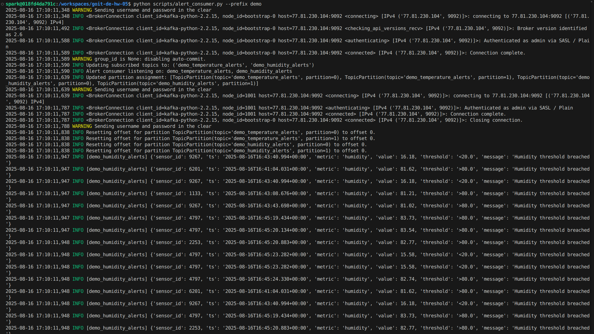
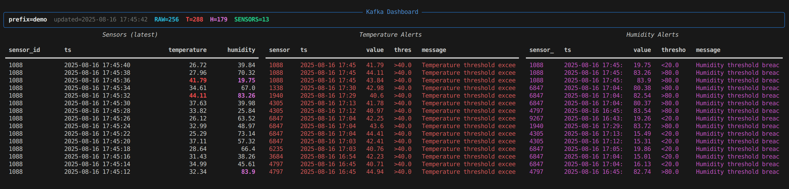

# [Домашнє завдання до теми «Apache Kafka»](https://www.edu.goit.global/learn/25315460/26851475/28349319/homework)

## Опис домашнього завдання
Компанія, яка займається розробкою систем моніторингу для Інтернету Речей (IoT). Основне завдання системи — збирати дані з різних датчиків, що встановлені в декількох різних будівлях, і аналізувати ці дані в реальному часі для відстеження таких показників, як температура та вологість.

Для цього використовується Apache Kafka як платформа обміну повідомленнями, що дозволяє ефективно передавати та обробляти великі обсяги даних.

Ваше завдання — реалізувати декілька компонентів цієї системи, використовуючи Python та Apache Kafka, у відповідності з інструкцією.

### Покрокова інструкція виконання

1. Створіть три топіки в Kafka (до імен топіків добавте свої імена або інші ідентифікатори, щоб імена топіків не дублювалися):
    - `building_sensors` — для зберігання даних з усіх датчиків,
    - `temperature_alerts` — для зберігання сповіщень про перевищення допустимого рівня температури,
    - `humidity_alerts` — для зберігання сповіщень про вихід рівня вологості за допустимі рамки.

2. Відправка даних до топіків:
    - Напишіть Python-скрипт, який імітує роботу датчика і періодично відправляє випадково згенеровані дані (температура та вологість) у топік `building_sensors`.
    - Дані мають містити ідентифікатор датчика, час отримання даних та відповідні показники.
    - Один запуск скрипту має відповідати тільки одному датчику. Тобто, для того, щоб імітувати декілька датчиків, необхідно запустити скрипт декілька разів (`ID` датчика може просто бути випадковим числом, але постійним (однаковим) для одного запуску скрипту. При повторному запуску `ID` датчика може змінюватись).
    - Температура — це випадкова величина від `25` до `45`.
    - Вологість — це випадкова величина від `15` до `85`.

3. Обробка даних.
    - Напишіть Python-скрипт, який підписується на топік `building_sensors`, зчитує повідомлення і перевіряє отримані дані:
        - якщо температура перевищує `40°C`, генерує сповіщення і відправляє його в топік `temperature_alerts`;
        - якщо вологість перевищує `80%` або сягає менше `20%`, генерує сповіщення і відправляє його в топік `humidity_alerts`
    - Сповіщення повинні містити ідентифікатор датчика, значення показників, час та повідомлення про перевищення порогового значення.

4. Остаточні дані:
    - Напишіть Python-скрипт, який підписується на топіки `temperature_alerts` та `humidity_alerts`, зчитує сповіщення виводить на екран повідомлення.

### Критерії прийняття

1. Створення 3 топіків (10 балів).
2. Генерація даних сенсорів та відправка даних в `building_sensors` (20 балів).
3. Отримання даних з `building_sensors`, фільтрація даних (25 балів).
4. Відправка фільтрованих даних в `temperature_alerts` та `humidity_alerts` (30 балів).
5. Отримання даних з `temperature_alerts` і `humidity_alerts` та виведення на екран (15 балів).

### Результат

1. Створення топіків:

```bash
python scripts/create_topic.py demo
```
- [create_topic.py](./scripts/create_topic.py)
- [app-20250816-170100.log](./out/app-20250816-170100.log)



2. Симуляція сенсора (продюсер) (one process == one sensor):

```bash
python scripts/sensor_producer.py --prefix demo --interval 2.0
```
- [sensor_producer.py](./scripts/sensor_producer.py)
- [app-20250816-170356.log](./out/app-20250816-170356.log)


3. Обробка (reads building_sensors and emits alerts):

```bash
python scripts/sensor_processor.py --prefix demo
```
- [sensor_processor.py](./scripts/sensor_processor.py)
- [app-20250816-170555.log](./out/app-20250816-170555.log)


4. Відправка фільрованих даних (prints alerts):

```bash
python scripts/alert_consumer.py --prefix demo
```
- [alert_consumer.py](./scripts/alert_consumer.py)
- [app-20250816-171011.log](./out/app-20250816-171011.log)


5. Запуск dashboard (демонстрація роботи системи):

```bash
python scripts/dashboard.py --prefix demo --start-producer --start-processor --start-alerts
```
- [dashboard.py](./scripts/dashboard.py)
- [app-20250816-171227.log](./out/app-20250816-171227.log)


### Вихідний код
- [Scripts](./scripts/)
- [Logs](./out/)

### Репозиторій
[goit-de-hw-05](https://github.com/nickolas-z/goit-de-hw-05)

